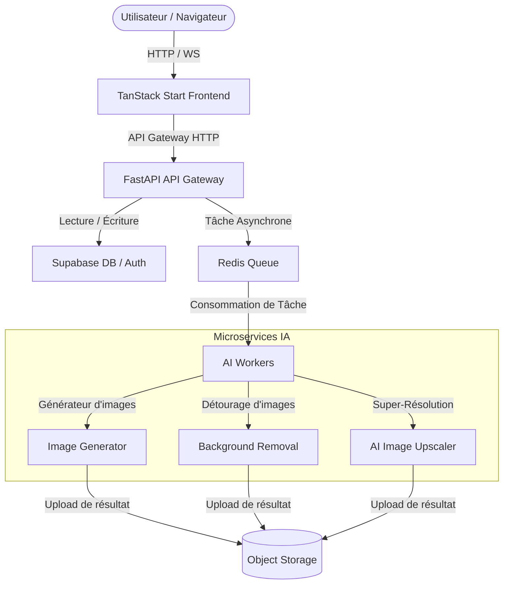

# Architecture de Souk Digital Marketplace

Bienvenue dans la documentation technique du projet Souk Digital Marketplace. 

Pour simplifier le développement et la maintenance de la plateforme à grande échelle, la documentation technique a été divisée en trois guides spécialisés :

---

## 📚 Guides d'Architecture & Contribution

### 🏛️ [1. Architecture Globale du Projet](file:///c:/Users/USER/Downloads/Souk%20Digital%20Marketplace/docs/ARCHITECTURE.md)
* Principes directeurs de conception (Separation of Concerns, API First, Stateless).
* Diagramme complet des flux système (Utilisateur ──► Frontend ──► Gateway ──► Workers IA).
* Organisation détaillée de l'arborescence des dossiers.
* Règles spécifiques au Server-Side Rendering (SSR).

### 📍 [2. Feuille de Route Technique (Roadmap)](file:///c:/Users/USER/Downloads/Souk%20Digital%20Marketplace/docs/ROADMAP.md)
* Trajectoire d'évolution fonctionnelle et technique (de la Marketplace aux clusters Kubernetes).

### 📜 [3. Décisions d'Architecture (ADR)](file:///c:/Users/USER/Downloads/Souk%20Digital%20Marketplace/docs/adr/)
* [ADR 0001: Choix de TanStack Start](file:///c:/Users/USER/Downloads/Souk%20Digital%20Marketplace/docs/adr/0001-use-tanstack-start.md)
* [ADR 0002: Choix de FastAPI](file:///c:/Users/USER/Downloads/Souk%20Digital%20Marketplace/docs/adr/0002-use-fastapi.md)
* [ADR 0003: Choix de Supabase](file:///c:/Users/USER/Downloads/Souk%20Digital%20Marketplace/docs/adr/0003-use-supabase.md)
* [ADR 0004: Isolation des Services IA](file:///c:/Users/USER/Downloads/Souk%20Digital%20Marketplace/docs/adr/0004-ai-services.md)

### 🌿 [2. Guide de Contribution (Code, Git & Tests)](file:///c:/Users/USER/Downloads/Souk%20Digital%20Marketplace/docs/CONTRIBUTING.md)
* Modèle de branches Git (Git Flow) et convention de nommage des commits (`feat:`, `fix:`...).
* Formatage et analyse statique obligatoires (ESLint, Prettier, Ruff, Black, isort, MyPy).
* Règle de barrière d'importation entre les couches Frontend et Backend.
* Stratégie de tests unitaires, de composants et d'inférence IA.
* Règles de sécurité (secrets, validation d'entrée).

### 🐳 [3. Guide de Déploiement & d'Exploitation](file:///c:/Users/USER/Downloads/Souk%20Digital%20Marketplace/docs/DEPLOYMENT.md)
* Architecture multi-conteneurs avec Docker (Gateway, Workers, Nginx, Redis).
* Matrice des variables d'environnement (.env client vs secrets backend).
* Observabilité, journalisation structurée et traçabilité des requêtes (Request ID).
* Objectifs de performance (First Paint, temps de réponse de l'API Gateway, inférence IA).

---

## 📊 Diagramme d'Architecture Cible

