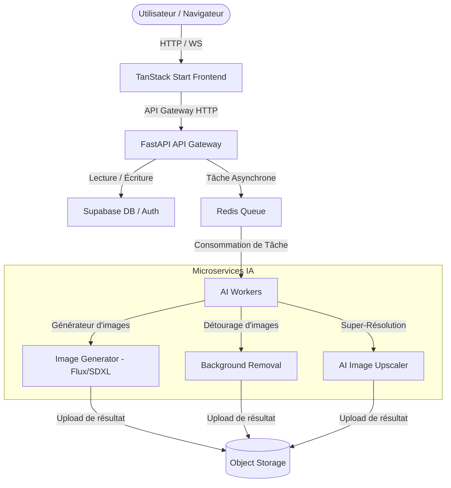

# Architecture de Souk Digital Marketplace

Ce document décrit l'organisation du dépôt, les responsabilités de chaque composant, et les principes directeurs pour assurer la robustesse, la sécurité et l'évolutivité de la plateforme.

---

## 🏛️ Principes d'Architecture

Souk Digital Marketplace est conçu selon les principes fondamentaux suivants :

* **Separation of Concerns (SoC)** : Chaque module et couche possède une responsabilité unique et isolée.
* **API First** : Toute communication entre le client et les services, ou entre services internes, s'effectue via des interfaces HTTP/WebSocket documentées et standardisées.
* **Stateless Services** : Les microservices et le serveur backend doivent rester sans état (stateless) autant que possible pour faciliter la mise à l'échelle.
* **Loose Coupling (Couplage faible)** : Pas de liaison directe entre le frontend et les services internes d'intelligence artificielle.
* **Scalability (Évolutivité)** : Chaque service (Gateway backend, modèles de traitement IA, stockage) peut être déployé et mis à l'échelle individuellement.
* **Security by Default** : Isolation réseau stricte ; aucune clé secrète ou information sensible n'est transmise ou exposée au client.

---

## 📊 Diagramme d'Architecture

Le flux global de traitement et d'intégration des données est le suivant :



---

## 📁 Structure du Dépôt

Pour assurer la compatibilité avec **Lovable** (qui nécessite le code source du frontend à la racine), le projet adopte une structure hybride avec isolation complète des services Python :

```text
Souk Digital Marketplace/
├── src/                      # Frontend TanStack Start (Lovable)
├── public/                   # Fichiers statiques publics
├── package.json              # Dépendances Node.js
├── vite.config.ts            # Configuration de build et dev server Vite
├── tsconfig.json             # Configuration TypeScript
├── .gitignore                # Exclusion Git
├── ARCHITECTURE.md           # Fichier d'accueil et redirections architecture
│
├── docs/                     # Documentation d'Architecture & Processus
│   ├── ARCHITECTURE.md       # Ce document (Architecture globale)
│   ├── CONTRIBUTING.md       # Conventions de Code, Git et Tests
│   └── DEPLOYMENT.md         # Déploiement Docker, Production et CI/CD
│
├── backend/                  # API Gateway Principale (FastAPI)
│   ├── routes/               # Endpoints REST
│   ├── services/             # Services métiers (Supabase, emails...)
│   ├── repositories/         # Couche d'accès aux données (data access)
│   ├── schemas/              # Schémas de validation Pydantic
│   ├── workers/              # Tâches asynchrones (Celery/Arq/Redis)
│   ├── config/               # Configurations et variables d'environnement
│   ├── requirements.txt      # Dépendances Python du backend
│   └── venv/                 # Environnement virtuel Python
│
├── ai-services/              # Microservices IA Indépendants
│   ├── image-generator/      # Générateur d'images (Flux / SDXL)
│   ├── upscaler/             # Super-résolution (ESRGAN...)
│   ├── background-remover/   # Suppression d'arrière-plan
│   ├── mockups/              # Générateur de mockups produits
│   ├── ocr/                  # Reconnaissance de texte
│   ├── shared/               # Code partagé entre services IA
│   ├── models/               # Script de téléchargement des poids (exclu du Git)
│   │   ├── README.md         # Instructions de téléchargement
│   │   └── download_models.py# Script de récupération des poids
│   └── venv/                 # Environnement virtuel Python dédié à l'IA
│
├── docker/                   # Fichiers de configuration de conteneurisation
│   ├── frontend/
│   ├── backend/
│   ├── postgres/
│   ├── redis/
│   ├── ollama/
│   └── nginx/
│
├── shared/                   # Configurations, types et schémas partagés
└── scripts/                  # Scripts d'automatisation globale (CI/CD, dev startup)
```

---

## 🔌 API Gateway & Communication

* **Passerelle unique** : Le frontend interagit exclusivement avec l'API Gateway FastAPI (`backend/`).
* **Microservices cachés** : Les microservices IA sous `ai-services/` ne sont jamais exposés à l'Internet public et répondent uniquement aux requêtes internes envoyées par le backend.
* **Asynchronisme IA** : Les requêtes lourdes (génération, traitement d'image) renvoient immédiatement un identifiant de tâche (`task_id`) avec statut `PENDING`. Le frontend effectue ensuite des appels périodiques (polling ou websocket) pour récupérer le résultat traité par les workers asynchrones (Redis Queue).

---

## 🖥️ Règles SSR (Server-Side Rendering)

Le code s'exécutant dans le contexte de rendu serveur (TanStack Start) doit suivre les restrictions suivantes :
* **Aucun accès aux globales de navigateur** : Pas d'appel direct à `window`, `document`, `navigator` ou `localStorage`. Les appels doivent être encapsulés de manière sécurisée (ex: `typeof window !== 'undefined'`).
* **Pas d'inférence en phase de rendu** : Les pipelines d'IA ne doivent jamais être démarrés pendant l'évaluation du SSR.
* **Pas de surcharge CPU** : Le SSR ne doit servir qu'à la structuration HTML et à l'hydratation initiale de la page pour le SEO, sans traitements bloquants.

---

## 🗂️ Gestion des Médias & Fichiers temporaires

* **Stockage Cloud uniquement** : Aucun fichier utilisateur n'est conservé de façon persistante sur les disques des serveurs web ou d'API. Tous les uploads sont directement poussés vers un espace d'Object Storage (Supabase Storage ou compatible S3).
* **Fichiers temporaires éphémères** : Les traitements locaux requis par les modèles d'IA utilisent des dossiers temporaires système (`/tmp` ou équivalents) et doivent être nettoyés automatiquement et immédiatement après la fin de l'inférence.
